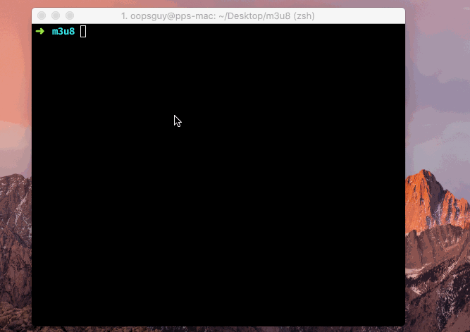

# M3u8

M3u8 - a mini m3u8 downloader written in Golang for downloading and merging TS files.

> Encrypted m3u8 is partial supported.

## Usage

**install**

```bash
go get -u github.com/oopsguy/m3u8
```

**build**

```bash
go build
```

**run**

Linux & MacOS

```
./m3u8 -u=http://example.com/index.m3u8 -o=/data/example
```

Windows PowerShell

```
.\m3u8 -u="http://example.com/index.m3u8" -o="D:\data\example"
```

**help**

```bash
m3u8 -h
```

## Download

[Binary packages and source code](https://github.com/oopsguy/m3u8/releases)

## Screenshots




## License 

MIT License